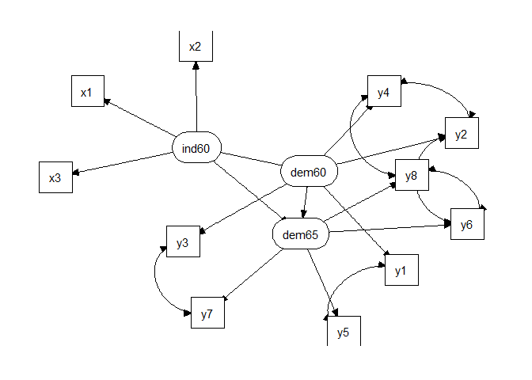
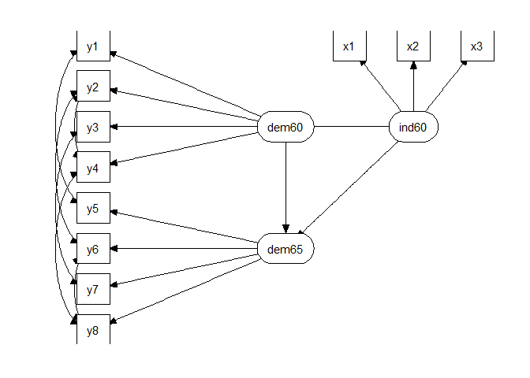
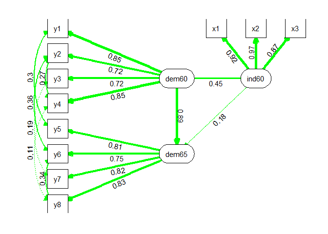

# tidylavaan

This package literally consists of one function - a method for
converting `lavaan` objects into `tbl_graph` objects.

***This function has been copied to [`MSBMisc`](https://github.com/mattansb/MSBMisc) and will be maintained there.***

## Download and Install

You can install `tidylavaan` from
[github](https://github.com/mattansb/tidylavaan) with:

``` r
# install.packages("devtools")
devtools::install_github("mattansb/tidylavaan")

# or just load the single function it contains:
# source("https://raw.githubusercontent.com/mattansb/tidylavaan/master/R/tidylavaan.R")
```

These functions are meant for use alongside
[`tidygraph`](https://CRAN.R-project.org/package=tidygraph) and
[`ggraph`](https://CRAN.R-project.org/package=ggraph) (as seen bellow).

You will also need:  
\- [`lavaan`](https://cran.r-project.org/package=lavaan), obviously.

## Example

In this example we will try to recreate the plot in the main page of
[`lavaan`’s website](http://lavaan.ugent.be/):


Let’s first fit the model:

``` r
library(lavaan)
```

    ## Warning: package 'lavaan' was built under R version 3.6.1

``` r
model <- '
   # latent variables
     ind60 =~ x1 + x2 + x3
     dem60 =~ y1 + y2 + y3 + y4
     dem65 =~ y5 + y6 + y7 + y8
   # regressions
     dem60 ~ ind60
     dem65 ~ ind60 + dem60
   # residual covariances
     y1 ~~ y5
     y2 ~~ y4 + y6
     y3 ~~ y7
     y4 ~~ y8
     y6 ~~ y8
'
fit <- sem(model, data = PoliticalDemocracy)
```

### Convert to `tbl_graph`

Using `tidylavaan` we can convert this object into a `tbl_graph` object:

``` r
library(tidygraph)
library(tidylavaan)

graph_data <- as_tbl_graph(fit, standardize = TRUE)
```

Wow, that was super hard. Let’s see what we got.

``` r
print(graph_data)
```

    ## # A tbl_graph: 14 nodes and 20 edges
    ## #
    ## # A directed acyclic simple graph with 1 component
    ## #
    ## # Node Data: 14 x 2 (active)
    ##   name  latent
    ##   <chr> <lgl> 
    ## 1 ind60 TRUE  
    ## 2 dem60 TRUE  
    ## 3 dem65 TRUE  
    ## 4 y5    FALSE 
    ## 5 y4    FALSE 
    ## 6 y6    FALSE 
    ## # ... with 8 more rows
    ## #
    ## # Edge Data: 20 x 11
    ##    from    to op    est.std     se     z pvalue ci.lower ci.upper
    ##   <int> <int> <chr>   <dbl>  <dbl> <dbl>  <dbl>    <dbl>    <dbl>
    ## 1     1     9 =~      0.920 0.0230  40.0      0    0.875    0.965
    ## 2     1    10 =~      0.973 0.0165  59.1      0    0.941    1.01 
    ## 3     1    11 =~      0.872 0.0311  28.1      0    0.811    0.933
    ## # ... with 17 more rows, and 2 more variables: relation_full <chr>,
    ## #   relation_type <chr>

### Ploting Path Diagram

Let’s plot it with `ggraph` ([learn more about plotting nodes and
edges](https://github.com/thomasp85/ggraph)).

``` r
library(ggraph)
```

    ## Warning: package 'ggplot2' was built under R version 3.6.1

``` r
graph_layout <- create_layout(graph_data, layout = "kk")

arrow_cap     <- circle(5, 'mm')
label_dodge   <- unit(2.5, 'mm')
label.padding <- unit(0.7,"lines")
  
ggraph(graph_layout) + 
  # edges
  geom_edge_link(aes(filter = relation_type == "regression"),
                 arrow     = arrow(20, unit(.3, "cm"), type = "closed"),
                 start_cap = arrow_cap,
                 end_cap   = arrow_cap) +
  geom_edge_arc(aes(filter = relation_type == "covariance"),
                arrow     = arrow(20, unit(.3, "cm"), type = "closed", ends = "both"),
                start_cap = arrow_cap,
                end_cap   = arrow_cap) +
  # nodes
  geom_node_label(aes(filter = !latent,
                      label  = name),
                  label.r       = unit(0, "lines"),
                  label.padding = label.padding) +
  geom_node_label(aes(filter = latent,
                      label  = name),
                  label.r       = unit(1.0, "lines"),
                  label.padding = label.padding) +
  # Scales and themes
  theme_graph()
```

<!-- -->

Not bad, but we can also specify the exact desired locations manually:

``` r
graph_layout$x <- c(3.5,2.5,2.5,1,1,1,1,1,3,3.5,4,1,1,1)
graph_layout$y <- -0.2*c(3,3,6,5,4,6,7,8,1,1,1,1,2,3)

ggraph(graph_layout) + 
  # edges
  geom_edge_link(aes(filter = relation_type == "regression"),
                 arrow     = arrow(20, unit(.3, "cm"), type = "closed"),
                 start_cap = arrow_cap,
                 end_cap   = arrow_cap) +
  geom_edge_arc(aes(filter = relation_type == "covariance"),
                arrow     = arrow(20, unit(.3, "cm"), type = "closed", ends = "both"),
                start_cap = arrow_cap,
                end_cap   = arrow_cap) +
  # nodes
  geom_node_label(aes(filter = !latent,
                      label  = name),
                  label.r       = unit(0, "lines"),
                  label.padding = label.padding) +
  geom_node_label(aes(filter = latent,
                      label  = name),
                  label.r       = unit(1.0, "lines"),
                  label.padding = label.padding) +
  # Scales and themes
  theme_graph()
```

<!-- -->

And now the world in our oyster\! Let’s pretty it up\!

``` r
ggraph(graph_layout) + 
  # edges
  geom_edge_link(aes(filter   = relation_type == "regression", 
                     width    = abs(est.std),
                     linetype = !pvalue < .05,
                     label    = round(est.std,2),
                     color    = est.std < 0),
                 angle_calc  = "along",
                 label_dodge = label_dodge,
                 arrow       = arrow(20, unit(.3, "cm"),type = "closed"),
                 start_cap   = arrow_cap,
                 end_cap     = arrow_cap) +
  geom_edge_arc(aes(filter   = relation_type == "covariance",
                    width    = abs(est.std),
                    linetype = !pvalue < .05,
                    label    = round(est.std,2),
                    color    = est.std < 0),
                angle_calc  = "along",
                label_dodge = label_dodge,
                arrow       = arrow(20, unit(.3, "cm"), type = "closed", ends = "both"),
                start_cap   = arrow_cap,
                end_cap     = arrow_cap) +
  # nodes
  geom_node_label(aes(filter = !latent,
                      label  = name),
                  label.r       = unit(0, "lines"),
                  label.padding = label.padding) +
  geom_node_label(aes(filter = latent,
                      label  = name),
                  label.r       = unit(1.0, "lines"),
                  label.padding = label.padding) +
  # Scales and themes
  scale_edge_color_manual(guide = FALSE, values = c("green","red")) +
  scale_edge_width_continuous(guide = FALSE, range = c(0.5,2)) +
  scale_edge_linetype_discrete(guide = FALSE) +
  theme_graph()
```

<!-- -->

## Authors

  - **Mattan S. Ben-Shachar** \[aut, cre\].
